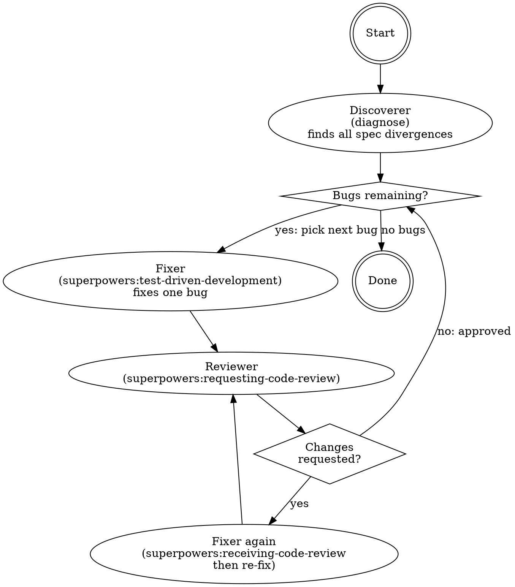

# Spec-Driven Bugfix Loop

## Overview

Orchestrate three specialized subagents in a repeating loop — discoverer, fixer, reviewer — until the codebase fully satisfies its spec. Uses `superpowers:subagent-driven-development` for sequential handoffs.

## Role-to-Skill Mapping

| Role | Skill to invoke |
|------|----------------|
| Discoverer | `diagnose` |
| Fixer | `superpowers:test-driven-development` (NOT `tdd`) |
| Reviewer | `superpowers:requesting-code-review` + `superpowers:receiving-code-review` |
| Orchestrator (you) | `superpowers:subagent-driven-development` |

## Loop Structure

## Exit Condition

The loop is done when **all** of the following hold:
- Discoverer finds zero spec divergences
- Every fix applied in this session has reviewer approval

"Tests pass" from the fixer is **not** a stopping condition. Re-run the discoverer after all bugs in the current list are fixed — fixes can introduce new divergences.

## Common Mistakes

| Mistake | Fix |
|---------|-----|
| Using `tdd` (mattpocock) instead of `superpowers:test-driven-development` | Always use the superpowers variant |
| Skipping `superpowers:receiving-code-review` when reviewer requests changes | Fixer must invoke it before re-attempting |
| Stopping after discoverer's first clean-ish pass | Re-run discoverer after each full fix cycle |
| Running discoverer in parallel with fixer | Discoverer must finish before fixer starts |

## Optimization: Parallel Fixes

If the discoverer returns a list of **independent** bugs (touching separate files with no shared state), switch from `superpowers:subagent-driven-development` to `superpowers:dispatching-parallel-agents` and fan out multiple fixer+reviewer pairs simultaneously. Merge all results before re-running the discoverer.
